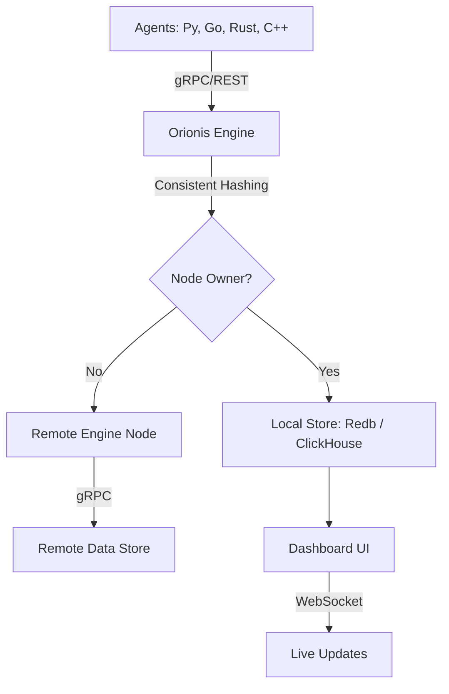

# Orionis Architecture Overview

## Component Diagram

## Core Modules

### 1. Clustering & Forwarding
Implemented in `clustering.rs`. Uses consistent hashing to ensure all events for a single `trace_id` land on the same physical node. Inter-node communication is powered by `tonic` (gRPC).

### 2. Multi-Tenancy & RBAC
Implemented in `auth.rs` and `server.rs`.
- **Isolation**: Every trace belongs to a `tenant_id`.
- **Roles**: Admin (full control), Member (read/write), Viewer (read-only).
- **Backends**: Both `LocalStore` and `ClickHouseStore` filter results based on the caller's tenant context.

### 3. Intelligence Platform (Next Phase)
Future work involves using the `ai_summarize` service to cluster common errors and provide root-cause analysis across distributed traces.

## Deployment
Orionis is cloud-native and supports Kubernetes. 
- **Binary**: Self-contained Rust executable.
- **Docker**: Multi-stage slim images (~50MB).
- **Scale**: Stateless engine nodes with distributed ingestion.
